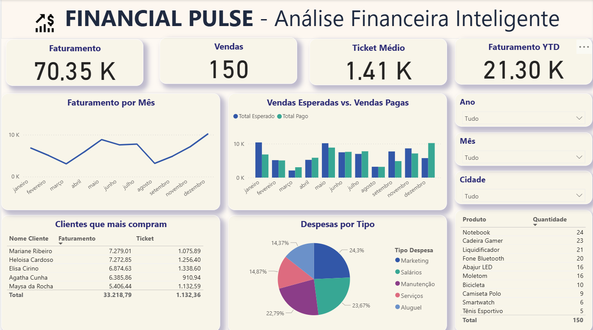

# 📊 Financial Pulse

Projeto completo de análise de dados para portfólio, integrando **Python, PostgreSQL, Power BI e GitHub**.

> Simulação de dados financeiros, automação com scripts, visualização interativa e repositório público.

## 🚀 Tecnologias
- Python + Pandas
- PostgreSQL + PgAdmin
- Power BI
- Git + GitHub

[🔗 Ver repositório no GitHub](https://github.com/vazlidiane/financial-pulse)
